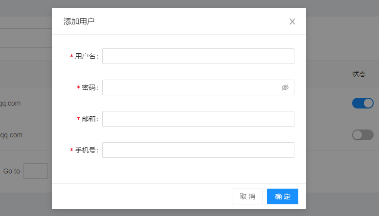
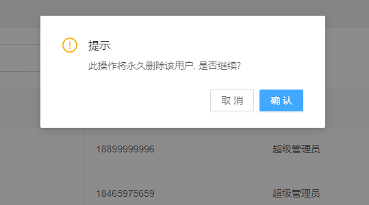
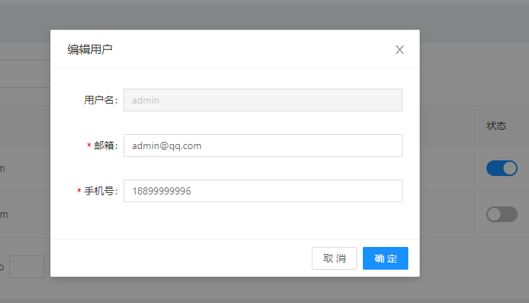
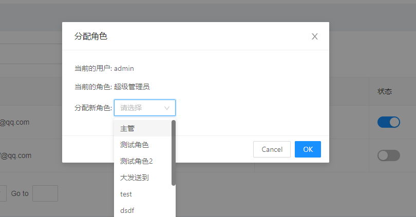
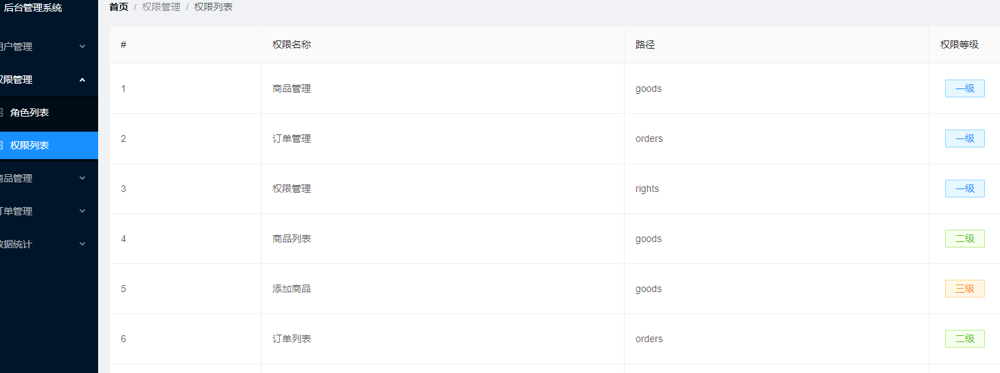
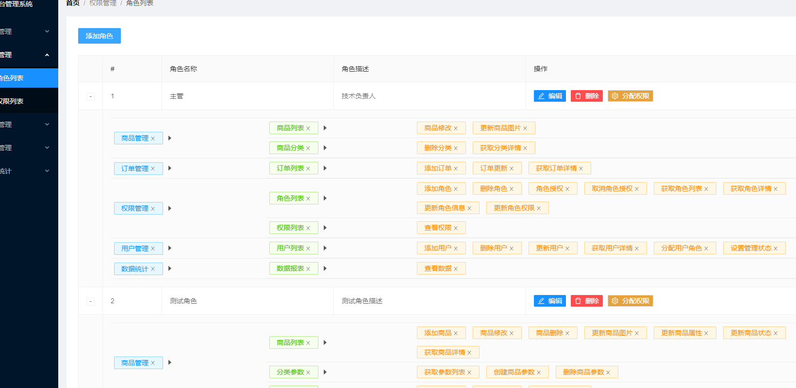
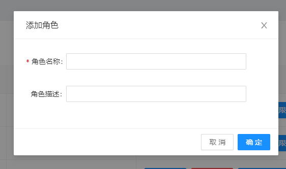

## 考核题

`要求：完成电商后台管理系统的用户操作(增删改查)、权限列表、角色列表(下拉,添加)等。`


### 考核相关提供

#### 文档网址

UI框架文档：https://2x.antdv.com/docs/vue/introduce-cn


#### 图标icon

`如有纰漏or不想要，请自行查找✔`

```js
编辑: EditOutlined
删除: DeleteOutlined
设置: SettingOutlined
警告: ExclamationCircleOutlined
右展开: CaretRightOutlined
```

#### 校验规则

- ###### 账号

  ```js
  1.必填，(错误提示:"请输入帐户名")
  2.长度最小4 最大16，(错误提示:"长度在4-16个字符之间")
  ```

- ###### 密码

  ```js
  1.必填，(错误提示:"请输入密码")
  2.长度最小6 最大16，(错误提示:"长度在6-16个字符之间")
  ```

#### 正则校验

```js
手机号正则：/^[1]([3-9])[0-9]{9}$/
邮箱正则：/^[a-zA-Z0-9_-]+@[a-zA-Z0-9_-]+(\.[a-zA-Z0-9_-]+)+$/
```

#### css样式

```css
.ant-tag {
  padding: 2px 14px;
  font-size: 14px;
}

.ant-tag {
  margin: 7px;
}

.bdtop {
  border-top: 1px solid #eee;
}

.bdbottom {
  border-bottom: 1px solid #eee;
}

.vcenter {
  display: flex;
  align-items: center;
}
```


#### 效果图参考

- ##### `添加用户`

  

- ##### `删除用户`

  

- ##### `编辑用户`

  

- ##### `分配角色`

  

- ##### `权限列表`

  

- ##### `角色列表`

  

- ##### 添加角色

  


### 考核需求

- ##### 用户列表页

  - ###### 添加用户

  - ###### 删除用户

  - ###### 编辑用户

  - ###### 分配角色

  - ###### 修改用户状态

- ##### 权限列表页

  - ###### 布局渲染

- ##### 角色列表页

  - ###### 布局渲染

  - ###### 下拉功能+渲染

  - ###### 添加角色


##### 问题咨询

如有疑问：`立即咨询 ` ~~`110`~~ `学委`


